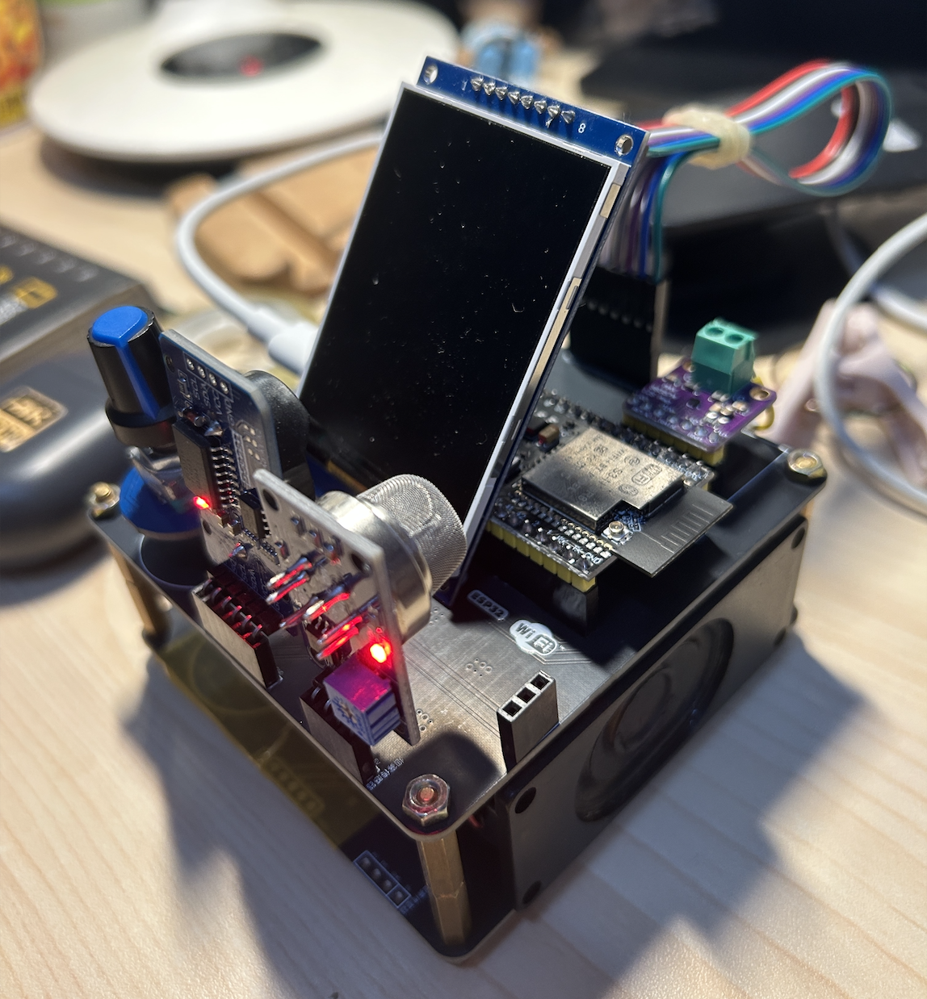
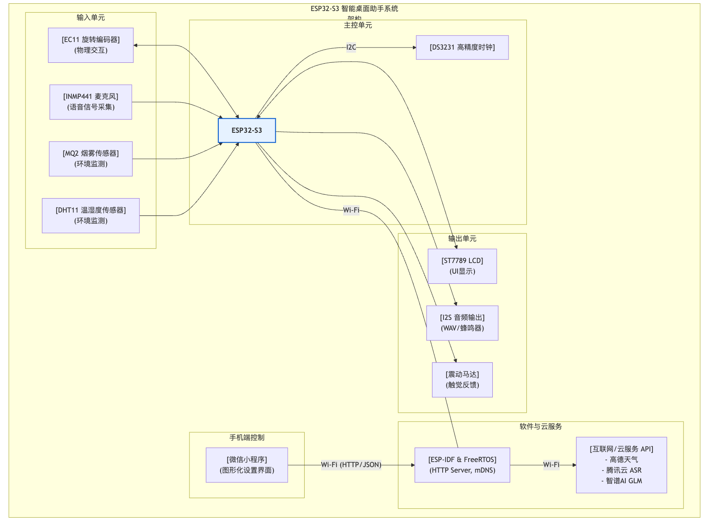

# ESP32S3 智能桌面助手

这是一个基于ESP32-S3的多功能智能桌面助手，集成了时钟显示、定时器、闹钟、天气预报、语音识别、AI对话、音频播放和震动提醒等功能。


<p align="center">图1:实物图</p>


<p align="center">图2:结构框图</p>

## 🎯 主要功能

- **实时时钟显示**：基于DS3231高精度时钟芯片
- **多桌面切换**：支持4个功能桌面，通过旋转编码器切换
- **定时器功能**：支持小时、分钟、秒的倒计时设置，带音频和震动提醒
- **闹钟功能**：支持绝对时间闹钟设置和自动响铃，带音频和震动提醒
- **天气预报功能**：显示详细的多天天气预报信息
- **语音识别功能**：基于腾讯云ASR的语音转文字功能
- **AI对话功能**：集成GLM-4-Flash大语言模型的智能对话
- **音频播放系统**：支持WAV文件播放和内置音调生成
- **音量调节功能**：系统音量0-100%可调，支持按键音效、铃声等
- **铃声选择功能**：可选择WAV文件铃声或内置双音调铃声
- **震动提醒功能**：定时器和闹钟结束时提供触觉反馈
- **内存监控系统**：实时监控内存使用，防止溢出
- **WiFi连接**：自动连接WiFi网络
- **农历显示**：显示农历日期信息
- **交互控制**：通过EC11旋转编码器进行操作

## 🔧 硬件连接

### ST7789 240x320 LCD SPI显示屏
- SCL -> IO12
- SDA -> IO11
- RES -> IO6
- DC -> IO7
- CS -> IO10
- BLK -> IO5

### DS3231时钟模块
- SCL -> IO8
- SDA -> IO9
- VCC -> 3.3V
- GND -> GND

### EC11旋转编码器
- CLK -> IO1
- DT -> IO2
- SW -> IO42

### INMP441麦克风模块
- SCK -> IO39
- WS -> IO21
- SD -> IO40
- VDD -> 3.3V
- GND -> GND
- **重要**：L/R引脚必须连接到GND（左声道输出）

### MQ2烟雾传感器
- VCC -> 3.3V
- GND -> GND
- AO -> IO4（模拟输入）
- **功能**：检测烟雾浓度，超过阈值时屏幕显示警告

### 震动马达模块
- VCC -> 3.3V
- GND -> GND
- IN -> IO3（数字输出）
- **功能**：定时器和闹钟结束时提供震动提醒

## 🚀 快速开始

### 1. 环境准备

确保已安装ESP-IDF开发环境：
```bash
# 激活ESP-IDF环境
source ~/esp/v5.4.1/esp-idf/export.sh
```

### 2. 下载LVGL库

**Linux/macOS用户**:
```bash
./setup_lvgl.sh
```

### 3. 配置API密钥

所有的API密钥都已集中在 `main/secrets.h` 文件中进行管理。为了配置您的密钥，请按照以下步骤操作：

1.  **复制示例文件**：将 `main/secrets.h.example` 文件复制一份，并重命名为 `main/secrets.h`。
2.  **编辑 `main/secrets.h`**：打开 `main/secrets.h` 文件，并填入您申请的 API 密钥，包括：
    * `WEATHER_API_KEY`：高德天气 API Key。
    * `GLM_API_KEY`：智谱AI GLM-4-Flash API Key。
    * `TENCENT_SECRET_ID` 和 `TENCENT_SECRET_KEY`：腾讯云语音识别的 SecretId 和 SecretKey。

> **注意**：`main/secrets.h` 文件已被添加到 `.gitignore` 中，不会被上传到您的 Git 仓库，以确保您的密钥安全。

### 4. 编译和烧录

```bash
# 设置目标芯片
idf.py set-target esp32s3

# 编译项目
idf.py build

# 烧录到开发板（包含SPIFFS分区）
idf.py flash

# 监控串口输出
idf.py monitor
```

或者使用一键脚本：
```bash
./build_and_flash.sh
```

## 📱 桌面功能详解

### 桌面1 - 主信息桌面
- **时间显示**：当前时间（小时:分钟）
- **日期显示**：当前日期（年/月/日 星期）
- **农历显示**：农历日期
- **WiFi状态**：显示连接状态和IP地址
- **天气信息**：当前温度和天气状况

**操作方式**：
- 按下旋转编码器：进入设置菜单
- 设置菜单包含：**Time**（时间设置）、**Pref**（偏好设置）、**AI**（AI助手/语音识别）

### 桌面2 - 定时器桌面
- **定时器功能**：支持设置小时、分钟、秒的倒计时
- **状态显示**：实时显示剩余时间
- **操作提示**：显示当前操作步骤
- **完成提示**：倒计时结束时显示"TIME UP!"
- **音频提醒**：播放选定的铃声（WAV文件或内置音调）
- **震动提醒**：启动震动马达进行触觉提醒

**操作方式**：
1. 进入桌面2，按下按键进入菜单
2. 按下按键开始设置小时
3. 旋转编码器调节数值，按键确认
4. 依次设置分钟、秒数
5. 设置完成后开始倒计时

### 桌面3 - 闹钟桌面
- **闹钟功能**：支持设置绝对时间的闹钟（小时、分钟）
- **状态显示**：显示闹钟时间和启用状态
- **智能检查**：每30秒检查是否到达闹钟时间
- **响铃提示**：到达设定时间时显示"ALARM!"
- **音频提醒**：播放选定的铃声（WAV文件或内置音调）
- **震动提醒**：启动震动马达进行触觉提醒

**操作方式**：
1. 进入桌面3，按下按键进入菜单
2. 旋转编码器调节小时（0-23），按键确认
3. 设置分钟（0-59），按键确认
4. 闹钟设置完成，显示✓标记
5. 到达设定时间时自动响铃，按键关闭

### 桌面4 - 天气预报桌面
- **详细预报**：显示未来3天的详细天气预报信息
- **丰富信息**：包含日期、星期、天气现象、温度范围、风向风力
- **自动更新**：每30分钟自动获取最新天气预报
- **API集成**：使用高德地图天气API获取权威数据

## ⚙️ 偏好设置功能

在桌面1中选择"Pref"可以进入偏好设置菜单，包含以下选项：

### 1. 时间格式设置
- **24小时制**：显示0-23小时格式
- **12小时制**：显示AM/PM格式
- 旋转编码器切换，按键确认

### 2. 网络时间设置
- **开启**：从网络同步时间
- **关闭**：使用本地DS3231时间
- 旋转编码器切换，按键确认

### 3. 音量设置
- **调节范围**：0-100%，默认20%
- **调节步长**：每次调节±5%
- **应用范围**：按键音效、定时器铃声、闹钟铃声
- 旋转编码器调节，按键确认

### 4. 铃声设置
- **WAV文件**：使用`/spiffs/ring.wav`播放
- **内置音调**：使用双音调蜂鸣声（800Hz和600Hz交替）
- 选择时可实时预览铃声效果
- 旋转编码器切换，按键确认

## 🎤 语音识别与AI对话

### 语音识别功能
1. **进入AI助手**：桌面1 → 按下 → 选择"AI" → 按下
2. **开始录音**：按下旋转编码器开始5秒录音
3. **查看结果**：语音转文字结果显示在屏幕上
4. **退出功能**：双击旋转编码器退出

### AI对话功能
- 语音识别完成后，自动发送识别结果给GLM-4-Flash
- AI回复会显示在串口监视器中
- 支持中文对话，智能理解用户意图

**数据流程**：
```
用户语音 → INMP441麦克风 → ESP32录音 → 腾讯云ASR → 识别文字 → GLM-4-Flash → AI回复 → 串口输出
```

## 🔊 音频播放系统

### WAV文件播放
- **文件存储**：WAV文件存储在SPIFFS分区（`/spiffs/ring.wav`）
- **音频格式**：支持16-bit PCM WAV文件
- **播放控制**：支持音量调节和停止控制
- **自动烧录**：编译时自动将`wav_files/`目录打包到SPIFFS

### 内置音调生成
- **双音调铃声**：800Hz和600Hz交替播放
- **持续时间**：0.8秒，带音量渐变效果
- **实时生成**：无需存储空间，动态生成PCM数据
- **低延迟**：响应速度快，适合提示音

### 音频驱动配置
- **I2S配置**：使用内部DAC，采样率44.1kHz
- **缓冲区管理**：动态分配，播放完成后自动释放
- **音量控制**：软件实现，支持0-100%音量调节

## 🔔 震动提醒系统

### 震动马达控制
- **硬件连接**：IO3控制震动马达开关
- **触发条件**：定时器结束、闹钟响铃
- **震动模式**：短促震动（300毫秒）
- **取消方式**：按下旋转编码器停止

### 震动功能特点
- **低功耗**：仅在需要时启动
- **即时响应**：与音频同步触发
- **安全保护**：自动超时停止，防止过热

## 🔧 系统配置

### 音频配置
- **录音采样率**：16kHz
- **播放采样率**：44.1kHz
- **位深度**：16位
- **声道**：单声道
- **录音时长**：5秒
- **音频格式**：WAV和PCM

### 内存监控系统
- **监控周期**：每30秒检查一次
- **警告阈值**：剩余内存 < 50KB
- **临界阈值**：剩余内存 < 20KB
- **自动回收**：LVGL对象安全删除机制
- **错误处理**：内存不足时显示警告

### SPIFFS文件系统
- **分区大小**：约11MB
- **存储内容**：WAV音频文件
- **自动挂载**：启动时自动初始化
- **错误处理**：文件缺失时回退到内置音调

### SSL/TLS配置
为了解决HTTPS连接问题，项目已启用以下配置：
```
CONFIG_ESP_TLS_INSECURE=y
CONFIG_ESP_TLS_SKIP_SERVER_CERT_VERIFY=y
```

## 📁 项目结构

```
├── CMakeLists.txt              # 主CMake配置（包含SPIFFS配置）
├── README.md                   # 项目说明
├── sdkconfig.defaults          # 默认配置
├── setup_lvgl.sh               # LVGL设置脚本
├── build_and_flash.sh          # 一键构建烧录脚本
├── partitions.csv              # 分区表配置
├── wav_files/                  # WAV音频文件目录
│   └── ring.wav               # 默认铃声文件
├── main/                       # 主程序目录
│   ├── main.c                 # 主程序源码
│   ├── audio_data.h/c         # 音频播放系统
│   ├── ds3231.h/c             # DS3231时钟驱动
│   ├── speech_recognition.h/c  # 语音识别功能
│   ├── ai_chat.h/c            # AI对话功能
│   ├── weather.h/c            # 天气功能
│   ├── lunar.h/c              # 农历功能
│   └── alarm.h/c              # 闹钟功能
└── components/                 # 组件目录
    ├── lvgl/                  # LVGL图形库
    └── esp-sr/                # ESP语音识别组件
```

## 🛠️ 故障排除

### 显示问题
- 检查SPI连接是否正确
- 确认显示屏电源和背光连接
- 检查LVGL库是否正确下载

### 时间问题
- 检查I2C连接是否正确
- 确认DS3231模块电源连接
- 查看串口监控器的错误信息

### 音频播放问题
- 检查WAV文件是否正确烧录到SPIFFS分区
- 确认音频文件格式为16-bit PCM WAV
- 检查I2S配置和内部DAC设置
- 调节音量设置（0-100%）

### 震动功能问题
- 检查IO3连接是否正确
- 确认震动马达电源连接
- 测试马达是否响应GPIO控制

### 语音识别问题
- 检查麦克风硬件连接，特别是L/R引脚接地
- 确认WiFi连接正常
- 验证腾讯云API密钥配置

### AI对话问题
- 检查GLM-4-Flash API Key配置
- 确认网络连接稳定
- 查看串口输出的错误信息

### 内存问题
- 监控串口输出的内存警告信息
- 检查是否有内存泄漏
- 确保LVGL对象正确释放
- 重启设备清理内存碎片

### 编译问题
- 确保已运行LVGL设置脚本
- 检查ESP-IDF环境是否正确配置
- 确认目标芯片设置为esp32s3
- 检查分区表配置是否正确

## ⚠️ 注意事项

### 安全提醒
- **不要将API密钥提交到公共代码仓库**
- **定期更换API密钥**
- **监控API使用量和费用**

### 硬件要求
- 确保ESP32S3的电源供应稳定
- DS3231模块需要纽扣电池以保持时间准确性
- INMP441麦克风的L/R引脚必须接地
- 震动马达需要足够的电流驱动
- 使用高质量的杜邦线连接以避免信号干扰

### 性能建议
- 在安静环境中使用语音识别以获得最佳效果
- 说话清晰，语速适中，距离麦克风10-30cm
- 避免背景噪音干扰
- 确保WiFi信号强度良好
- 定期重启设备以清理内存碎片

### 音频文件要求
- WAV文件格式：16-bit PCM，单声道
- 建议采样率：44.1kHz或22.05kHz
- 文件大小控制在1MB以内
- 文件名必须为`ring.wav`

## 🔄 更新日志

### v2.0 - AI对话功能
- ✅ 集成GLM-4-Flash大语言模型
- ✅ 语音识别后自动AI对话
- ✅ 解决HTTPS连接问题
- ✅ 优化内存管理和错误处理

### v1.5 - 语音识别功能
- ✅ 集成腾讯云语音识别API
- ✅ INMP441麦克风支持
- ✅ 32位转16位音频处理
- ✅ 内存优化和错误处理

### v1.0 - 基础功能
- ✅ 多桌面时钟显示
- ✅ 定时器和闹钟功能
- ✅ 天气预报集成
- ✅ 农历显示功能

## 🎯 功能特色

### 🔊 智能音频系统
- **多格式支持**：WAV文件和内置音调双重选择
- **音量智能控制**：统一的音量管理系统
- **实时预览**：设置铃声时即时播放预览
- **低延迟播放**：优化的音频缓冲和播放机制

### 🔔 震动反馈系统
- **精准定时**：与音频同步的震动提醒
- **节能设计**：仅在需要时激活，自动超时保护
- **触觉增强**：为听力不便用户提供替代提醒方式

### 🧠 智能内存管理
- **实时监控**：30秒周期的内存使用检查
- **预警系统**：多级内存警告和处理机制
- **安全释放**：LVGL对象的延迟删除保护机制
- **防崩溃设计**：多重错误检查和异常处理

### ⚙️ 用户友好界面
- **直观设置**：分类清晰的偏好设置菜单
- **实时反馈**：设置更改即时生效和预览
- **状态指示**：清晰的功能状态和连接指示
- **操作引导**：每个功能都有明确的操作提示

## 📱 微信小程序控制

为了提供更便捷的配置方式，本项目支持通过微信小程序与设备进行通信，实现远程设置。

### 功能简介
通过小程序，您可以：
- **同步时间**：一键将手机时间同步到设备。
- **设置闹钟**：远程设定闹钟时间，并开启或关闭。
- **管理定时器**：设置倒计时，并可以远程开始、暂停或重置。
- **切换时间格式**：轻松切换12小时制和24小时制显示。
- **创建提醒事项**：快速添加待办提醒，到时设备会进行提示。
- **查看设备状态**：实时获取设备当前的各项状态信息。

### 通信原理
1.  ESP32在连接到WiFi后，会启动一个轻量级的HTTP服务器。
2.  小程序与ESP32在同一个局域网内。
3.  小程序通过HTTP请求，调用ESP32上预设的API接口（如 `/set-alarm`, `/set-time` 等），将设置数据以JSON格式发送给设备。
4.  ESP32接收到请求后，解析数据并调用相应的功能函数来更新设备设置。


## 📄 许可证

本项目采用MIT许可证，详见LICENSE文件。

---

**享受你的智能桌面助手！** 🚀🎙️🤖🔊🔔

---
---

# ESP32S3 Smart Desktop Assistant (English Version)

This is a multi-functional smart desktop assistant based on the ESP32-S3, integrating features such as a clock display, timer, alarm, weather forecast, voice recognition, AI chat, audio playback, and vibration alerts.

## 🎯 Main Features

- **Real-time Clock Display**: Based on the high-precision DS3231 clock chip.
- **Multi-Desktop Switching**: Supports 4 functional desktops, switchable via a rotary encoder.
- **Timer Function**: Supports countdown settings for hours, minutes, and seconds with audio and vibration alerts.
- **Alarm Function**: Supports absolute time alarm settings and automatic ringing with audio and vibration alerts.
- **Weather Forecast**: Displays detailed multi-day weather forecast information.
- **Voice Recognition**: Speech-to-text functionality based on Tencent Cloud ASR.
- **AI Chat**: Intelligent conversation integrated with the GLM-4-Flash large language model.
- **Audio Playback System**: Supports WAV file playback and built-in tone generation.
- **Volume Control**: System volume adjustable from 0-100%, supporting key tones, ringtones, etc.
- **Ringtone Selection**: Choose between WAV file ringtones or built-in dual-tone ringtones.
- **Vibration Alert**: Provides tactile feedback when the timer or alarm ends.
- **Memory Monitoring System**: Real-time monitoring of memory usage to prevent overflow.
- **WiFi Connection**: Automatically connects to WiFi networks.
- **Lunar Calendar Display**: Shows lunar date information.
- **Interactive Control**: Operated via an EC11 rotary encoder.

## 🔧 Hardware Connections

### ST7789 240x320 LCD SPI Display
- SCL -> IO12
- SDA -> IO11
- RES -> IO6
- DC -> IO7
- CS -> IO10
- BLK -> IO5

### DS3231 Clock Module
- SCL -> IO8
- SDA -> IO9
- VCC -> 3.3V
- GND -> GND

### EC11 Rotary Encoder
- CLK -> IO1
- DT -> IO2
- SW -> IO42

### INMP441 Microphone Module
- SCK -> IO39
- WS -> IO21
- SD -> IO40
- VDD -> 3.3V
- GND -> GND
- **Important**: The L/R pin must be connected to GND (for left-channel output).

### MQ2 Smoke Sensor
- VCC -> 3.3V
- GND -> GND
- AO -> IO4 (Analog Input)
- **Function**: Detects smoke concentration and displays a warning on the screen when the threshold is exceeded.

### Vibration Motor Module
- VCC -> 3.3V
- GND -> GND
- IN -> IO3 (Digital Output)
- **Function**: Provides vibration alerts when the timer and alarm go off.

## 🚀 Quick Start

### 1. Environment Setup

Ensure you have the ESP-IDF development environment installed:
```bash
# Activate the ESP-IDF environment
source ~/esp/v5.4.1/esp-idf/export.sh
```

### 2. Download LVGL Library

**For Linux/macOS users**:
```bash
./setup_lvgl.sh
```

### 3. Configure API Keys

All API keys are managed in the `main/secrets.h` file. To configure your keys, follow these steps:

1.  **Copy the example file**: Make a copy of `main/secrets.h.example` and rename it to `main/secrets.h`.
2.  **Edit `main/secrets.h`**: Open the `main/secrets.h` file and fill in your API keys, including:
    * `WEATHER_API_KEY`: Amap Weather API Key.
    * `GLM_API_KEY`: Zhipu AI GLM-4-Flash API Key.
    * `TENCENT_SECRET_ID` and `TENCENT_SECRET_KEY`: Tencent Cloud Speech Recognition SecretId and SecretKey.

> **Note**: The `main/secrets.h` file has been added to `.gitignore` and will not be uploaded to your Git repository, ensuring the security of your keys.

### 4. Compile and Flash

```bash
# Set the target chip
idf.py set-target esp32s3

# Build the project
idf.py build

# Flash to the development board (including SPIFFS partition)
idf.py flash

# Monitor serial output
idf.py monitor
```

Or use the one-click script:
```bash
./build_and_flash.sh
```

## 📱 Desktop Function Details

### Desktop 1 - Main Information Desktop
- **Time Display**: Current time (Hour:Minute)
- **Date Display**: Current date (Year/Month/Day, Day of the week)
- **Lunar Display**: Lunar date
- **WiFi Status**: Shows connection status and IP address
- **Weather Info**: Current temperature and weather conditions

**Operation**:
- Press the rotary encoder: Enter the settings menu.
- The settings menu includes: **Time** (Time settings), **Pref** (Preferences), **AI** (AI Assistant/Voice Recognition).

### Desktop 2 - Timer Desktop
- **Timer Function**: Supports setting a countdown for hours, minutes, and seconds.
- **Status Display**: Shows the remaining time in real-time.
- **Operation Prompt**: Displays the current operation step.
- **Completion Prompt**: Displays "TIME UP!" when the countdown finishes.
- **Audio Alert**: Plays the selected ringtone (WAV file or built-in tone).
- **Vibration Alert**: Activates the vibration motor for tactile feedback.

**Operation**:
1. Go to Desktop 2, press the button to enter the menu.
2. Press the button to start setting the hour.
3. Rotate the encoder to adjust the value, press to confirm.
4. Set the minutes and seconds in sequence.
5. The countdown starts after setup is complete.

### Desktop 3 - Alarm Desktop
- **Alarm Function**: Supports setting an alarm for an absolute time (hour, minute).
- **Status Display**: Shows the alarm time and enabled status.
- **Smart Check**: Checks if it's alarm time every 30 seconds.
- **Ringing Prompt**: Displays "ALARM!" at the set time.
- **Audio Alert**: Plays the selected ringtone (WAV file or built-in tone).
- **Vibration Alert**: Activates the vibration motor for tactile feedback.

**Operation**:
1. Go to Desktop 3, press the button to enter the menu.
2. Rotate the encoder to adjust the hour (0-23), press to confirm.
3. Set the minute (0-59), press to confirm.
4. Alarm is set, a ✓ mark is displayed.
5. Rings automatically at the set time; press the button to turn it off.

### Desktop 4 - Weather Forecast Desktop
- **Detailed Forecast**: Displays a detailed weather forecast for the next 3 days.
- **Rich Information**: Includes date, day of the week, weather phenomenon, temperature range, wind direction, and wind force.
- **Automatic Updates**: Fetches the latest weather forecast every 30 minutes.
- **API Integration**: Uses the Amap Weather API for authoritative data.

## ⚙️ Preferences Function

In Desktop 1, selecting "Pref" enters the preferences menu, which includes the following options:

### 1. Time Format Setting
- **24-Hour Format**: Displays time in 0-23 hour format.
- **12-Hour Format**: Displays time in AM/PM format.
- Switch with the rotary encoder, confirm with a press.

### 2. Network Time Setting
- **On**: Synchronize time from the network.
- **Off**: Use the local DS3231 time.
- Switch with the rotary encoder, confirm with a press.

### 3. Volume Setting
- **Range**: 0-100%, default 20%.
- **Step**: Adjusts by ±5% each time.
- **Applies to**: Key tones, timer ringtones, alarm ringtones.
- Adjust with the rotary encoder, confirm with a press.

### 4. Ringtone Setting
- **WAV File**: Plays from `/spiffs/ring.wav`.
- **Built-in Tone**: Uses a dual-tone beep (alternating 800Hz and 600Hz).
- Preview the ringtone in real-time when selecting.
- Switch with the rotary encoder, confirm with a press.

## 🎤 Voice Recognition and AI Chat

### Voice Recognition Function
1. **Enter AI Assistant**: Desktop 1 → Press → Select "AI" → Press.
2. **Start Recording**: Press the rotary encoder to start a 5-second recording.
3. **View Result**: The speech-to-text result is displayed on the screen.
4. **Exit Function**: Double-press the rotary encoder to exit.

### AI Chat Function
- After voice recognition, the result is automatically sent to GLM-4-Flash.
- The AI's reply is displayed in the serial monitor.
- Supports conversation in Chinese, intelligently understanding user intent.

**Data Flow**:
```
User's Voice → INMP441 Mic → ESP32 Recording → Tencent Cloud ASR → Recognized Text → GLM-4-Flash → AI Reply → Serial Output
```

## 🔊 Audio Playback System

### WAV File Playback
- **File Storage**: WAV files are stored in the SPIFFS partition (`/spiffs/ring.wav`).
- **Audio Format**: Supports 16-bit PCM WAV files.
- **Playback Control**: Supports volume adjustment and stopping.
- **Automatic Flashing**: The `wav_files/` directory is automatically packaged into SPIFFS during compilation.

### Built-in Tone Generation
- **Dual-Tone Ringtone**: Alternating 800Hz and 600Hz tones.
- **Duration**: 0.8 seconds with a volume fade effect.
- **Real-time Generation**: No storage space needed; PCM data is generated dynamically.
- **Low Latency**: Fast response, suitable for prompt sounds.

### Audio Driver Configuration
- **I2S Configuration**: Uses the internal DAC with a 44.1kHz sample rate.
- **Buffer Management**: Dynamically allocated and automatically released after playback.
- **Volume Control**: Implemented in software, supporting 0-100% volume adjustment.

## 🔔 Vibration Alert System

### Vibration Motor Control
- **Hardware Connection**: IO3 controls the vibration motor switch.
- **Trigger Conditions**: Timer ends, alarm rings.
- **Vibration Mode**: Short bursts of vibration (300ms).
- **Cancellation**: Press the rotary encoder to stop.

### Vibration Feature Highlights
- **Low Power**: Activated only when needed.
- **Instant Response**: Triggers in sync with audio.
- **Safety Protection**: Automatic timeout to prevent overheating.

## 🔧 System Configuration

### Audio Configuration
- **Recording Sample Rate**: 16kHz
- **Playback Sample Rate**: 44.1kHz
- **Bit Depth**: 16-bit
- **Channels**: Mono
- **Recording Duration**: 5 seconds
- **Audio Formats**: WAV and PCM

### Memory Monitoring System
- **Monitoring Period**: Checks every 30 seconds.
- **Warning Threshold**: Remaining memory < 50KB.
- **Critical Threshold**: Remaining memory < 20KB.
- **Automatic Garbage Collection**: Safe deletion mechanism for LVGL objects.
- **Error Handling**: Displays a warning when memory is low.

### SPIFFS File System
- **Partition Size**: Approximately 11MB.
- **Stored Content**: WAV audio files.
- **Auto-mount**: Initializes automatically on startup.
- **Error Handling**: Falls back to the built-in tone if a file is missing.

### SSL/TLS Configuration
To resolve HTTPS connection issues, the project has enabled the following configurations:
```
CONFIG_ESP_TLS_INSECURE=y
CONFIG_ESP_TLS_SKIP_SERVER_CERT_VERIFY=y
```

## 📁 Project Structure

```
├── CMakeLists.txt              # Main CMake config (includes SPIFFS config)
├── README.md                   # Project description
├── sdkconfig.defaults          # Default configuration
├── setup_lvgl.sh               # LVGL setup script
├── build_and_flash.sh          # One-click build and flash script
├── partitions.csv              # Partition table configuration
├── wav_files/                  # WAV audio files directory
│   └── ring.wav               # Default ringtone file
├── main/                       # Main program directory
│   ├── main.c                 # Main source code
│   ├── audio_data.h/c         # Audio playback system
│   ├── ds3231.h/c             # DS3231 clock driver
│   ├── speech_recognition.h/c  # Voice recognition function
│   ├── ai_chat.h/c            # AI chat function
│   ├── weather.h/c            # Weather function
│   ├── lunar.h/c              # Lunar calendar function
│   └── alarm.h/c              # Alarm function
└── components/                 # Components directory
    ├── lvgl/                  # LVGL graphics library
    └── esp-sr/                # ESP speech recognition component
```

## 🛠️ Troubleshooting

### Display Issues
- Check if the SPI connection is correct.
- Confirm the display's power and backlight connections.
- Check if the LVGL library was downloaded correctly.

### Time Issues
- Check if the I2C connection is correct.
- Confirm the DS3231 module's power connection.
- Check the serial monitor for error messages.

### Audio Playback Issues
- Check if the WAV file was correctly flashed to the SPIFFS partition.
- Confirm the audio file format is 16-bit PCM WAV.
- Check the I2S configuration and internal DAC settings.
- Adjust the volume setting (0-100%).

### Vibration Function Issues
- Check if the IO3 connection is correct.
- Confirm the vibration motor's power connection.
- Test if the motor responds to GPIO control.

### Voice Recognition Issues
- Check the microphone hardware connection, especially the L/R pin to ground.
- Confirm the WiFi connection is normal.
- Verify the Tencent Cloud API key configuration.

### AI Chat Issues
- Check the GLM-4-Flash API Key configuration.
- Confirm the network connection is stable.
- Check the serial output for error messages.

### Memory Issues
- Monitor the memory warning messages in the serial output.
- Check for memory leaks.
- Ensure LVGL objects are released correctly.
- Restart the device to clear memory fragmentation.

### Compilation Issues
- Ensure the LVGL setup script has been run.
- Check if the ESP-IDF environment is configured correctly.
- Confirm the target chip is set to esp32s3.
- Check if the partition table configuration is correct.

## ⚠️ Precautions

### Security Reminders
- **Do not commit API keys to public code repositories.**
- **Change API keys periodically.**
- **Monitor API usage and costs.**

### Hardware Requirements
- Ensure a stable power supply for the ESP32S3.
- The DS3231 module requires a coin cell battery to maintain time accuracy.
- The L/R pin of the INMP441 microphone must be grounded.
- The vibration motor requires sufficient current to operate.
- Use high-quality DuPont wires to avoid signal interference.

### Performance Suggestions
- Use voice recognition in a quiet environment for best results.
- Speak clearly at a moderate pace, 10-30cm from the microphone.
- Avoid background noise interference.
-
- Ensure good WiFi signal strength.
- Restart the device periodically to clear memory fragmentation.

### Audio File Requirements
- WAV file format: 16-bit PCM, mono.
- Recommended sample rate: 44.1kHz or 22.05kHz.
- Keep the file size under 1MB.
- The filename must be `ring.wav`.

## 🔄 Update Log

### v2.0 - AI Chat Function
- ✅ Integrated GLM-4-Flash large language model.
- ✅ Automatic AI chat after voice recognition.
- ✅ Resolved HTTPS connection issues.
- ✅ Optimized memory management and error handling.

### v1.5 - Voice Recognition Function
- ✅ Integrated Tencent Cloud Speech Recognition API.
- ✅ INMP441 microphone support.
- ✅ 32-bit to 16-bit audio processing.
- ✅ Memory optimization and error handling.

### v1.0 - Basic Functions
- ✅ Multi-desktop clock display.
- ✅ Timer and alarm functions.
- ✅ Weather forecast integration.
- ✅ Lunar calendar display function.

## 🎯 Feature Highlights

### 🔊 Smart Audio System
- **Multi-format Support**: Dual choice of WAV files and built-in tones.
- **Smart Volume Control**: Unified volume management system.
- **Real-time Preview**: Instant playback preview when setting ringtones.
- **Low-latency Playback**: Optimized audio buffering and playback mechanism.

### 🔔 Vibration Feedback System
- **Precise Timing**: Vibration alerts synchronized with audio.
- **Energy-saving Design**: Activated only when needed, with automatic timeout protection.
- **Tactile Enhancement**: Provides an alternative alert for users with hearing impairments.

### 🧠 Smart Memory Management
- **Real-time Monitoring**: 30-second cycle for memory usage checks.
- **Warning System**: Multi-level memory warnings and handling mechanisms.
- **Safe Release**: Delayed deletion protection mechanism for LVGL objects.
- **Anti-crash Design**: Multiple error checks and exception handling.

### ⚙️ User-Friendly Interface
- **Intuitive Settings**: Clearly categorized preferences menu.
- **Real-time Feedback**: Instant effect and preview of setting changes.
- **Status Indicators**: Clear indicators for function status and connections.
- **Operation Guidance**: Clear operational prompts for each function.

## 📱 WeChat Mini Program Control

To provide a more convenient configuration method, this project supports communication with the device via a WeChat Mini Program for remote settings.

### Function Introduction
With the Mini Program, you can:
- **Sync Time**: Sync your phone's time to the device with one tap.
- **Set Alarm**: Remotely set the alarm time and enable or disable it.
- **Manage Timer**: Set a countdown timer and start, pause, or reset it remotely.
- **Switch Time Format**: Easily switch between 12-hour and 24-hour display formats.
- **Create Reminders**: Quickly add to-do reminders, and the device will alert you at the set time.
- **View Device Status**: Get real-time status information from the device.

### Communication Principle
1.  After connecting to WiFi, the ESP32 starts a lightweight HTTP server.
2.  The Mini Program and the ESP32 are on the same local area network.
3.  The Mini Program sends HTTP requests to predefined API endpoints on the ESP32 (e.g., `/set-alarm`, `/set-time`), sending setting data in JSON format.
4.  The ESP32 receives the request, parses the data, and calls the corresponding function to update the device settings.

## 📄 License

This project is licensed under the MIT License. See the LICENSE file for details.

---

**Enjoy your smart desktop assistant!** 🚀🎙️🤖🔊🔔
